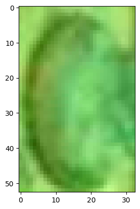
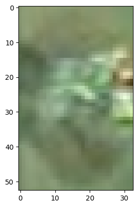
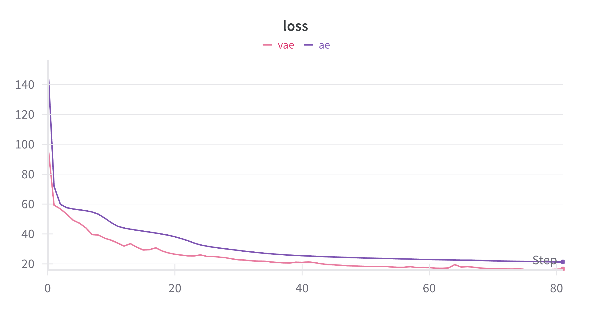
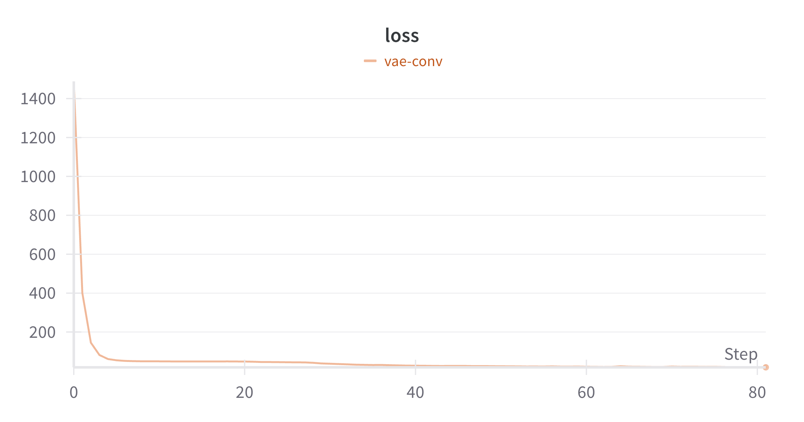

# Task 2

# Задача детекции аномалий

## План реализации
Модель обучается на непроливах.  
Сравнивается MSE (loss модели) на валидационной выборке и выборке с проливами. Строится ROC-AUC и подбирается оптимальное значение порога для MSE.
Модель и найденный порог используются для разделения проливов и непроливов на тестовой выборке.
Эксперименты проводились с двумя архитектурами: автоэнкодер и вариационный автоэнкодер.

Полученные изображения были приведены в форму 3x33x53.

  
  

- 1-ое изображение это непроливы      
- 2-ое изображение это проливы  

### Используя optuna было проведено более 120 экспериментов, включающих в себя:
- Вариация чисел эпох от 10 до 100.
- Изменение learning rate: от 1e-5 до 1e-3.
- Изменение размеры мини-батчей: 32, 64, 128, 256, 512, 600, 780 и 1024.
- Исследовал влияние различных размеров скрытого пространства: 2, 4, 8, 16, 32, и 64.
- Исследовал влияние каждой модели на результат: AE, VAE.

Лучшими парметрами по optuna оказались:
- Оптимизатор: Adam
- model = VAE
- latent_dims = 4
- learning_rate = 0.00025211639381666004
- epochs = 82
- batch_size = 780
- Loss: MSE Loss

# Результат:

Результат:  
True Positive rate 0.938  
True Neagtive rate: 0.871  
ROC AUC на тесте: 0.904  

# Эксперимент 1
Увеличим глубину сети. Добавим больше слоёв с различными размерностями в Encoder и Decoder как в AE, так и VAE. Это должно помочь сети захватить более сложные зависимости.
Будем использовать параметры, рекомендованные optuna.

AE    
True Positive rate 0.822  
True Neagtive rate: 0.914  
ROC AUC score: 0.868  
___
VAE  
True Positive rate 0.922  
True Neagtive rate: 0.764  
ROC AUC score: 0.843  

Результаты по сравнению с базовой архитектурой получились немного хуже. Думаю, что использование большого количества линейных слоев вызвало проблемы с запаздыванием сходимости. Видимо, cлишком маленькое латентное пространство заставило модель «сжимать» слишком много информации в ограниченное количество измерений, что и привило к такому результату.

# Эксперимент 2
Попробуем использовать архитектуру VAE, которая будет содержать conv слои и на основе его попробуем получить более лучшие результаты. Возможно, conv слои будут лучше выделять паттерны.

True Positive rate 0.605  
True Neagtive rate: 0.828  
ROC AUC score: 0.716  

Результаты по сравнению с базовой архитектурой получились значительно хуже. Видимо, из-за слишком агрессивной свертки или малой ширины каналов инофрмация теряется.