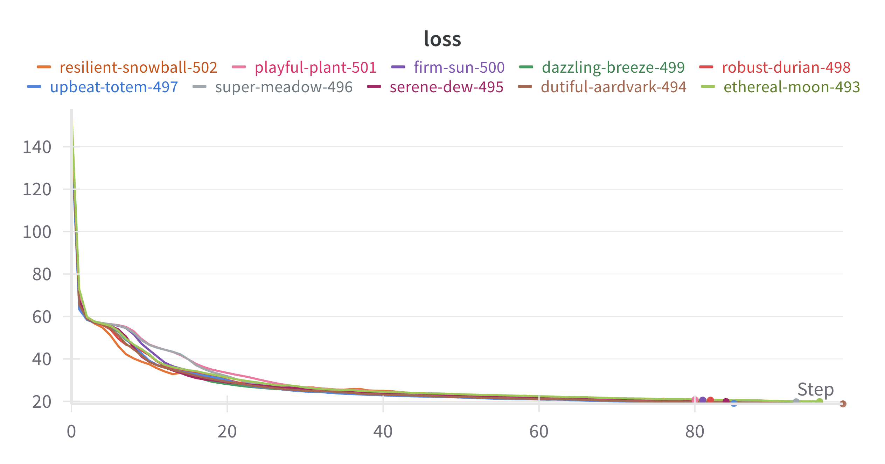

# Task 2

# Задача детекции аномалий

## План реализации
Модель обучается на непроливах.  
Сравнивается MSE (loss модели) на валидационной выборке и выборке с проливами. Строится ROC-AUC и подбирается оптимальное значение порога для MSE.
Модель и найденный порог используются для разделения проливов и непроливов на тестовой выборке.
Эксперименты проводились с двумя архитектурами: автоэнкодер и вариационный автоэнкодер.

### Используя optuna было проведено более 120 экспериментов, включающих в себя:
- Вариация чисел эпох от 10 до 100.
- Изменение learning rate: от 1e-5 до 1e-3.
- Изменение размеры мини-батчей: 32, 64, 128, 256, 512, 600, 780 и 1024.
- Исследовал влияние различных размеров скрытого пространства: 2, 4, 8, 16, 32, и 64.
- Исследовал влияние каждой модели на результат: AE, VAE.

### Оптимизатор
Adam

Лучшими парметрами по optuna оказались:
- model = VAE
- latent_dims = 4
- learning_rate = 0.00025211639381666004
- epochs = 82
- batch_size = 780

Результат:  
True Positive rate 0.938  
True Neagtive rate: 0.871  
ROC AUC на тесте: 0.904  

# Результат:
