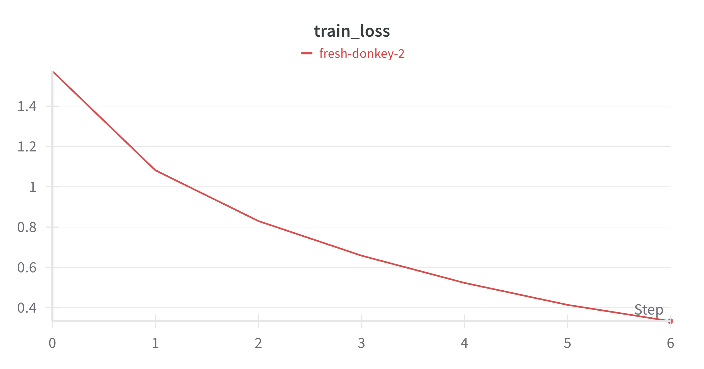
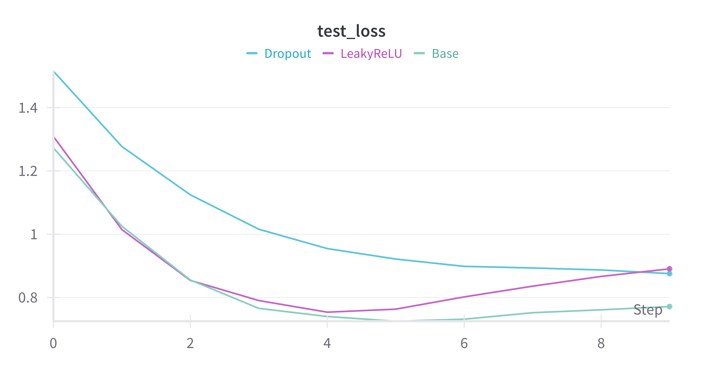
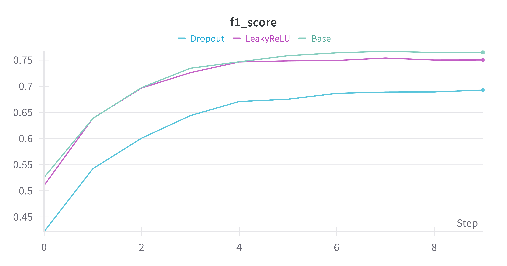
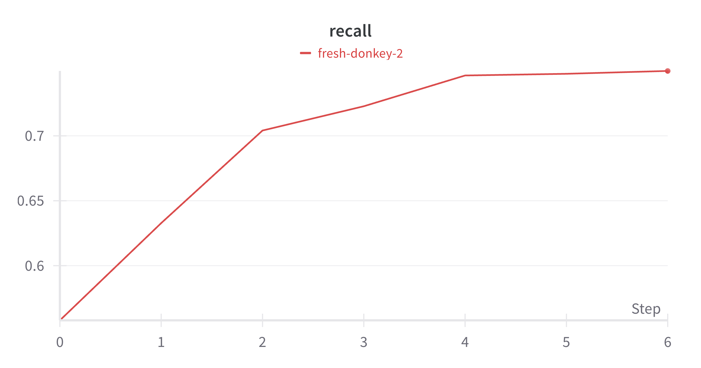
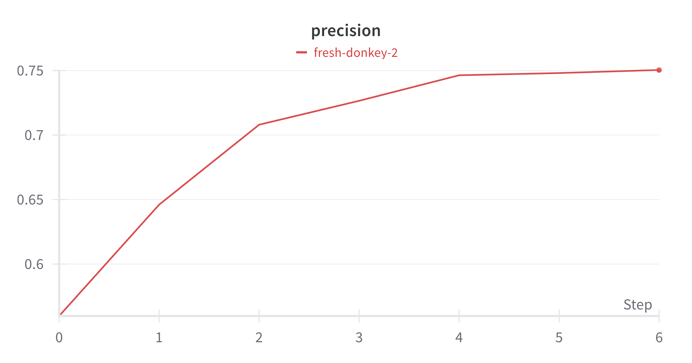

# Task 1

## Задача: многоклассовая классификация

## Датасет: CIFAR-10
### Содержит 10 классов, каждая из которых представляет определённый класс объектов:
- Самолёты (airplane)
- Автомобили (automobile)
- Птицы (bird)
- Кошки (cat)
- Олени (deer)
- Собаки (dog)
- Лягушки (frog)
- Лошади (horse)
- Корабли (ship)
- Грузовики (truck)

### Количество изображений:
   - 60,000 изображений в сумме.
   - Из них:
     - 50,000 изображений используются для обучения (train set).
     - 10,000 изображений отведены для тестирования (test set).

### Размер изображений:
   - Каждое изображение имеет размер 32x32 пикселя.
   - Это означает, что каждое изображение состоит из 3072 чисел (32x32x3 RGB-канала).

### Цветовое представление:
   - Датасет представлен в цветном формате (RGB).

## Архитектура: ResNet34

### Гиперпараметры:
- оптимайзер: AdamW
- lr: 0.001 
- betas: (0.8, 0.999)
- scheduler: ExponentialLR
- epoch: 10
- batch: 16 

### Метрики
По всем классам:
- precision = 0.76
- recall = 0.76
- f1 = 0.76

Accuracy для каждого класса:
| Класс | Точность |
|-------|----------|
| plane | 82.6 %   |
| car   | 85.3 %   |
| bird  | 67.8 %   |
| cat   | 57.4 %   |
| deer  | 71.4 %   |
| dog   | 65.4 %   |
| frog  | 84.0 %   |
| horse | 77.8 %   |
| ship  | 87.8 %   |
| truck | 84.8 %   |

# Эксперименты
<code>Эксперимент 1</code>: Влияние активационной функции на сходимость
- Цель эксперимента -> Понять, как выбор функции активации (<code>LeakyReLU</code> vs <code>ReLU</code>) влияет на скорость сходимости и результаты обучения. 
- Идея эксперимента -> Заменить LeakyReLU на ReLU и провести обучение.
- Результаты эксперимента -> Графики train/test loss.
- Сравнение с baseline: Сходимость с LeakyReLU происходит давольно быстрее, посольку все нейроны, которые имеют отрицательные градиенты также влияют на направление сходимости, и не зануляются как в случае с ReLU.
- Выводы -> Использование LeakyReLU помогает быстрее достигать сходимости при минимальной разнице в точности (на ~1%).

<code>Эксперимент 2</code>: Влияние регуляризации на сходимость и точность модели
- Цель эксперимента -> Проверить, сохранит ли модель аналогичную или близкую точность, а также как изменится процесс обучения по сравнению с базовой версией, если использовать Dropout.
- Идея эксперимента -> Обучить модель на 10 эпох и сравнить графики train/test loss c безлайном. Если разрыв между train/test увеличивается, это может свидетельствовать о переобучении, что прослеживалось и в безлайне.
- Результаты эксперимента -> Графики train/test loss.
- Сравнение с baseline -> Отключенные нейроны во время обучения повышают обобщающую способность используемых нейронов, но сильно влияют на скорость сходимости в целом, что и влияет на точность модели.
- Выводы -> Добавление Dropout помогает снизить переобучение, что подтверждается меньшим разрывом между train/test loss, однако из-за сходимости модель теряется в точности.
# Логирование
Графики во время обучения baseline-a и экспериментов.

### Loss train и test

| Loss Train               | Loss Test                |                        |
|--------------------------|--------------------------|------------------------|
|  |  |                        |

### Метрики

| F1                       | Recall                   | Precision              |
|--------------------------|--------------------------|------------------------|
|         |     |  |

---
